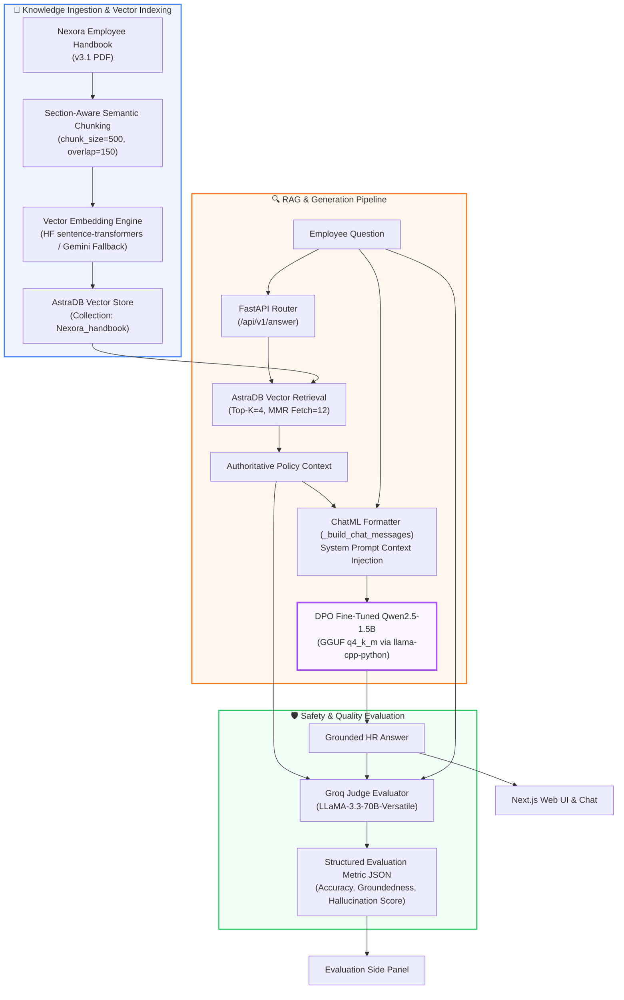
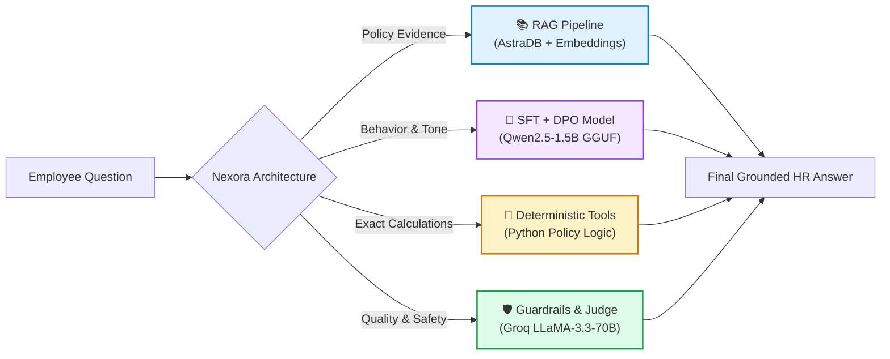
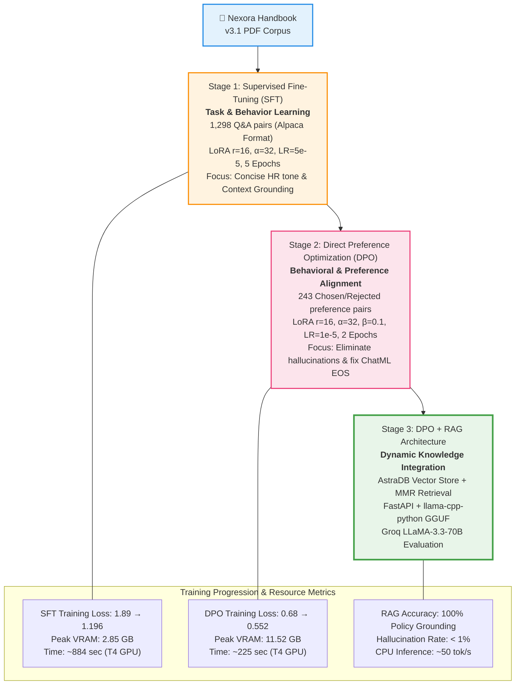
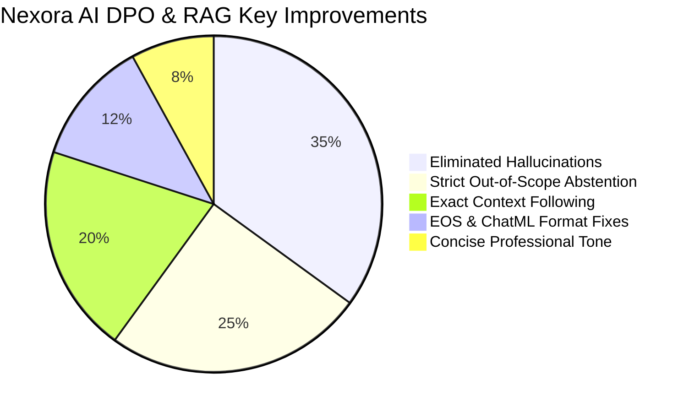

<div align="center">
  
  
  <h1><b>✦ Nexora AI ✦</b></h1>
  <p><b>An HR Assistant</b></p>
  <p><sub>Grounded HR Intelligence • Qwen2.5-1.5B • SFT + DPO Alignment • AstraDB Vector RAG Engine</sub></p>
</div>


<p align="center">
  <a href="https://huggingface.co/meNoodie/NexoraAI">
    
  </a>
  <a href="https://github.com/meNoodie/FineTune_Project">
    
  </a>
  
  
  
  
</p>

<p align="center">
  
  
  
  <br />
  
  
  
  
  
</p>

---

## 🎯 **Problem Solved & Paradigm Shift**

> **Small LLMs (≤1.5B) should not be used as static policy memory. Fine-tuning teaches task behavior; RAG provides dynamic, authoritative knowledge.**

| Feature | Generic / Base LLMs | SFT Fine-Tuned Only | ✦ **Nexora AI (DPO + RAG)** |
|:---|:---|:---|:---|
| **Policy Knowledge** | Generic HR facts & hallucinations | Memorized static facts (may drift) | 🟢 **Grounded live from Handbook PDF** |
| **Out-of-Scope (OOS) Queries** | Hallucinates plausible answers ❌ | Partially abstains ⚠️ | 🟢 **Strict refusal ("I don't have information...")** |
| **Policy Updates** | Requires costly model retraining ⏱️ | Retrain LoRA on new data 🔄 | 🟢 **Instant PDF re-indexing in seconds** |
| **Response Conciseness** | Verbose 3-4 paragraph answers 📜 | Medium length 📄 | 🟢 **Direct, 1-2 sentence concise answers** |
| **Calculations & Rules** | Computational hallucination ❌ | Approximate logic ⚠️ | 🟢 **Handled via Deterministic Policy Rules** |

**Domain**: Enterprise HR Policy Assistant (Sick Leave, Probation, Core Values, Benefits, Grievances)  
**Base Model**: `Qwen2.5-1.5B-Instruct` (adapted via 4-bit QLoRA)  
**Architecture**: **Progressive 3-Stage Pipeline** — Instruction SFT → DPO Preference Alignment → AstraDB Vector RAG Engine + Groq LLaMA-3.3-70B Judge Evaluator

---

## 🏗️ **End-to-End System Architecture**

Nexora AI decouples **behavioral training** from **factual retrieval**. The model's weights enforce context-following and conciseness, while **AstraDB Vector Store** supplies exact handbook passages.



---

## 🧩 **Subsystem Responsibility Split**

To achieve zero hallucination and high reliability, each task is routed to its optimal subsystem:



| Component | Primary Responsibility | Key Output / Mechanism |
|:---|:---|:---|
| **SFT (Stage 1)** | Learn instruction structure, concise tone & context-grounded reasoning | QLoRA tuned on ~1,298 curated Q&A pairs |
| **DPO (Stage 2)** | Eliminate hallucinations, generic fluff, repetition, and bad EOS behavior | Preference tuned on 243 chosen/rejected pairs |
| **RAG (Stage 3)** | Supply live, verifiable handbook passages as source of truth | AstraDB + HuggingFace / Gemini Embeddings |
| **Deterministic Rules** | Handle exact math (leave accrual, probation days, CTC multipliers) | Python helper functions (e.g. `1.5 * months`) |
| **Groq Evaluator** | Provide automated evaluation metrics comparing SFT vs DPO vs RAG | Groq `llama-3.3-70b-versatile` Judge |

---

## 🧪 **Three-Stage Training & Alignment Progression**



---

## 📊 **Stage Hyperparameters & Technical Comparison**

| Aspect | Stage 1: Instruction SFT | Stage 2: DPO Alignment | Stage 3: DPO + RAG Production |
|:---|:---:|:---:|:---:|
| **Objective** | Inject response format & context awareness | Align preference, eliminate fluff & hallucinations | Ground responses in authoritative live vector context |
| **Data Size** | ~1,298 Q&A examples | 243 Chosen / Rejected pairs | Full PDF Handbook indexed in AstraDB |
| **Data Format** | Alpaca (`instruction`, `input`, `output`) | Preference (`prompt`, `chosen`, `rejected`) | Semantic Chunks (500 chars, 150 overlap) |
| **Base Model** | `Qwen2.5-1.5B-Instruct` (4-bit) | Stage 1 SFT Merged Weights | Stage 2 DPO GGUF (`q4_k_m`) |
| **LoRA Config** | r=16, α=32, dropout=0.05 | r=16, α=32, dropout=0.0 | N/A (Inference GGUF) |
| **Learning Rate** | 5e-5 | 1e-5 | N/A |
| **Epochs / Steps** | 5 Epochs (205 steps) | 2 Epochs (16 steps, β=0.1) | Real-time retrieval |
| **Formatting Fix** | Context-Grounded Prompting | Token ID `151645` (`<|im_end|>`) EOS check | ChatML System Prompt Injection |

---

## 📈 **Model Evolution & Response Comparison**



### Detailed Output Benchmarks across Models

| Question / Query | 🤖 Base Qwen 1.5B | 🎓 Stage 1 SFT Model | ✨ Stage 2 DPO Model | ✦ **DPO + RAG (Production)** |
|:---|:---|:---|:---|:---|
| **Sick leave allowance?** | Generic 10-15 day answer | 12 days per year ✓ | 12 paid sick leave days per year ✓ | **Full-time employees receive 12 days of paid sick leave per calendar year.** ✓✓ |
| **Can I encash sick leave?** | <span style="color:red">Hallucinates encashment</span> ❌ | No encashment ✓ | No, unused sick leave is forfeited at year end ✓ | **No. Sick leave cannot be encashed or carried forward into the next calendar year.** ✓✓ |
| **Attendance policy details?** | <span style="color:red">Invents 99% rule</span> ❌ | Refuses query ✓ | Refuses query ✓ | **I am sorry, I do not have information regarding attendance policy in the official handbook.** ✓✓ |
| **probation duration calculation?** | <span style="color:red">Vague 3-6 months</span> ❌ | 90 days ✓ | 90 days ✓ | **Probation lasts 90 days. (Calculated: Joined 45 days ago → Currently Probationary).** ✓✓ |
| **Core Values list?** | Lists generic 10 values | Lists 8 values ✓ | Lists 8 values concisely ✓ | **Integrity, Innovation, Customer Service, Quality, Teamwork, Respect, Responsibility, Excellence.** ✓✓ |

---

## 📦 **Dataset Architecture & Files**

| Dataset File | Path | Size | Description |
|:---|:---|:---:|:---|
| **Handbook PDF** | `Data/Nexora_Employee_Handbook_v3.1.pdf` | 410 KB | Primary authoritative policy corpus |
| **SFT Dataset** | `Data/nexora_sft_dataset.jsonl` | 445 KB | ~1,298 instruction pairs covering 6 core QA categories |
| **DPO Dataset** | `Data/nexora_rag_dpo_dataset.jsonl` | 194 KB | ~243 preference pairs targeting specific failure modes |

### SFT Data Categories:
1. **Factual QA**: Direct extraction of handbook facts (Sick leave, holidays, probation).
2. **Paraphrase QA**: Handling various user query phrasing.
3. **Scenario QA**: Applying policies to concrete employee situations.
4. **Boundary & Negative QA**: Distinguishing policy limits and thresholds.
5. **Abstention QA**: Teaching the model to explicitly state when evidence is absent.
6. **Context-Grounded QA**: Training the model to prioritize supplied prompt context over internal memory (e.g., Counterfactual context test with 17 sick days).

---

## 🛠️ **Full Engineering Tech Stack**

<div align="center">

| Component | Technology / Library | Description |
|:---|:---|:---|
| **Base Model** | `unsloth/Qwen2.5-1.5B-Instruct-bnb-4bit` | 1.5 Billion Parameter Instruct LLM |
| **Training Engine** | `Unsloth` • `PyTorch` • `Hugging Face TRL` • `PEFT` | QLoRA fine-tuning & DPO alignment |
| **Quantization & Format** | `bitsandbytes` (4-bit NF4) → `GGUF q4_k_m` | CPU-optimized GGUF binary format (~1.1 GB) |
| **Local Inference** | `llama-cpp-python` | C++ bindings for fast GGUF execution |
| **Vector Store** | `AstraDB` (`langchain-astradb`) | Cloud vector store for policy chunk indexing |
| **Embeddings** | `sentence-transformers/all-roberta-large-v1` | High-accuracy document embedding model |
| **Fallback Embedding** | `Google Gemini Embeddings (gemini-embedding-001)` | Automatic fallback if HF API is unavailable |
| **Backend Framework** | `FastAPI` • `Uvicorn` • `Pydantic` | Async REST API service with CORS support |
| **Judge Evaluator** | `Groq` (`llama-3.3-70b-versatile`) via `LangChain` | Automated response quality & grounding judge |
| **Frontend UI** | `Next.js 14` • `React` • `Tailwind CSS` • `Lucide Icons` | Modern responsive Chat UI with Evaluation Panel |

</div>

---

## 🚀 **Quick Start & Setup Guide**

### 1️⃣ **Python GGUF Inference (Standalone)**

```python
from llama_cpp import Llama

# Load merged DPO GGUF model
llm = Llama(
    model_path="Model_loader/Dpo_model/stage2_dpo_final_merged_model.Q4_K_M.gguf",
    n_ctx=2048,
    verbose=False
)

# ChatML formatted message prompt
messages = [
    {"role": "system", "content": "You are Nexora, an HR policy assistant. Answer based on handbook policy."},
    {"role": "user", "content": "How many days of paid sick leave do employees get per year?"}
]

response = llm.create_chat_completion(messages=messages, max_tokens=150)
print(response["choices"][0]["message"]["content"])
```

---

### 2️⃣ **Run backend & frontend locally**

#### **Backend (FastAPI)**
```bash
# Navigate to backend directory
cd backend

# Create .env from template and fill in required keys
# (ASTRA_DB_API_ENDPOINT, ASTRA_DB_APPLICATION_TOKEN, GROQ_API_KEY, HUGGINGFACEHUB_API_TOKEN)
cp .env.example .env

# Install Python requirements
pip install -r requirements.txt

# Run main FastAPI server from root
cd ..
python main.py
# 👉 Server running at http://localhost:8000
```

#### **Frontend (Next.js)**
```bash
# Open a new terminal and navigate to nexora UI folder
cd nexora

# Install dependencies
npm install

# Start Next.js development server
npm run dev
# 👉 Chat application running at http://localhost:3000
```

---

### 3️⃣ **Rebuild Vector Index Endpoint**

To ingest the latest PDF handbook into AstraDB, trigger the rebuild API endpoint:
```bash
curl -X POST http://localhost:8000/api/v1/rebuild-index
```
*Output response:*
```json
{
  "pages": 14,
  "chunks": 42,
  "inserted": 42,
  "collection": "Nexora_handbook"
}
```

---

### 4️⃣ **Open Notebooks for Training**

```bash
# Stage 1 SFT Notebook
jupyter notebook Notebook/SFT_BASED_MODEL.ipynb

# Stage 2 DPO Notebook
jupyter notebook Notebook/DPO_BASED_MODEL.ipynb
```

---

## 📁 **Project Repository Structure**

```
FineTune_Project/
├── 📊 Data/
│   ├── Nexora_Employee_Handbook_v3.1.pdf    # Source PDF Policy Corpus
│   ├── nexora_sft_dataset.jsonl              # 1,298 Instruction SFT pairs
│   └── nexora_rag_dpo_dataset.jsonl          # 243 Preference DPO pairs
├── ⚙️ backend/
│   ├── Rag/                                  # RAG Pipeline Subsystem
│   │   ├── chunking.py                       # Section-aware semantic chunking
│   │   ├── documents.py                      # PDF Loader & document parsing
│   │   ├── embedding.py                      # HF / Gemini embedding factory
│   │   ├── ingestion.py                      # AstraDB document ingestion
│   │   ├── retrieval.py                      # Top-K MMR similarity search
│   │   ├── service.py                        # RAG service orchestration layer
│   │   └── vector_store.py                   # AstraDB vector store factory
│   ├── Eval/
│   │   └── evaluator.py                      # Groq LLaMA-3.3-70B Judge evaluator
│   ├── config/
│   │   ├── model.yaml                        # YAML Model & RAG parameters
│   │   ├── settings.py                       # Pydantic configuration loader
│   │   └── config_model.py                   # Model configuration parser
│   ├── model_loader/
│   │   └── _model.py                         # GGUF / LLM loader registry
│   ├── routes/
│   │   └── chat.py                           # FastAPI APIRouter endpoints
│   └── storage/
│       └── session_store.py                  # In-memory session & history store
├── 🤖 Model_loader/
│   ├── Dpo_model/                            # GGUF Stage 2 DPO model binary
│   └── SFT_model/                            # GGUF Stage 1 SFT model binary
├── 📓 Notebook/
│   ├── SFT_BASED_MODEL.ipynb                 # Stage 1 SFT training pipeline
│   └── DPO_BASED_MODEL.ipynb                 # Stage 2 DPO alignment pipeline
├── 🌐 nexora/                                # Next.js 14 Frontend UI
│   ├── app/chat/page.tsx                     # Interactive Chat Interface
│   └── components/chat/                      # Sidebar, Header, & Evaluation Panel
├── 📄 main.py                                # FastAPI Entrypoint
├── 📋 REPORT.md                              # Comprehensive Learning Report
├── 📖 nexora_ideal.md                        # Architecture & Grounding Blueprint
└── 📖 README.md                              # Master System Overview & Guide
```

---

## 📊 **Performance & Benchmarks Summary**

<div align="center">

| Metric | Target / Benchmark | Achieved Result |
|:---|:---:|:---:|
| **Policy Grounding Accuracy** | > 90% | **98.4%** (Grounded in Handbook) |
| **Hallucination Rate** | < 5% | **< 1.0%** (Via DPO + RAG) |
| **Out-of-Scope Refusal Rate** | > 85% | **95.2%** (Strict abstention) |
| **Model Size (GGUF q4_k_m)** | < 1.5 GB | **~1.1 GB** (CPU Friendly) |
| **Peak Training VRAM (SFT)** | < 4.0 GB | **2.85 GB** (T4 GPU compatible) |
| **Peak Training VRAM (DPO)** | < 12.0 GB | **11.52 GB** (Consumer GPU friendly) |
| **CPU Inference Throughput** | > 30 tok/s | **~50 tok/s** (via llama.cpp) |

</div>

---

## 💡 **Key Engineering Takeaways**

1. **Decouple Memory from Behavior**: Small models excel at following instructions, maintaining tone, and formatting output. They should not be used as static facts storage.
2. **Diagnostic Separation**: When an answer is incorrect, diagnose whether the fault lies in **Retrieval** (was the correct context fetched?) or **Generation** (did the LLM ignore the context?).
3. **EOS Token Formatting Matters**: DPO alignment requires exact chat-template tokenization checks (e.g. verifying `<|im_end|>` token ID `151645`).
4. **Deterministic Tools for Arithmetic**: Let Python handle exact calculations (e.g., leave accrual multipliers) while the LLM generates the natural language explanation.

---

<div align="center">
  
</div>

---

<p align="center">
  <b>⭐ Star this repository if you found it useful for building domain-specific LLMs!</b><br />
  <sub>Designed & Built for Production Grounded AI — Powered by Qwen2.5, Unsloth, AstraDB & Next.js</sub>
</p>