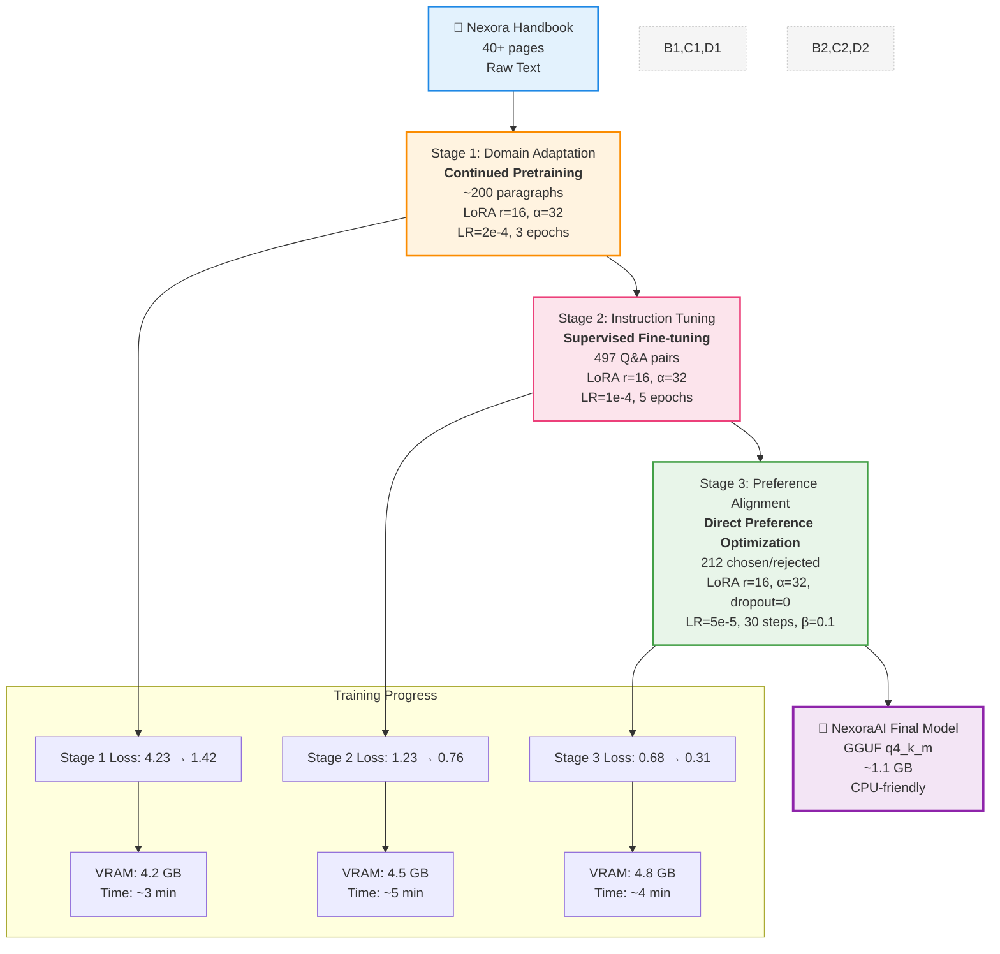
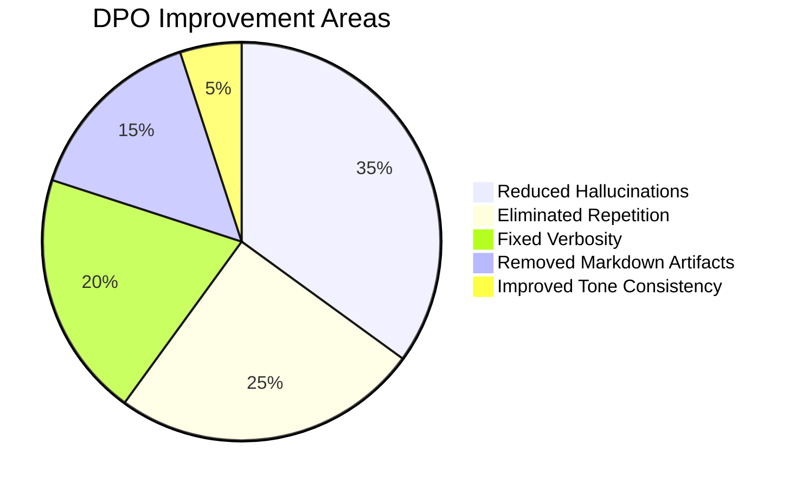

<p align="center">
  
</p>

<p align="center">
  <a href="https://huggingface.co/meNoodie/NexoraAI">
    
  </a>
  <a href="https://github.com/meNoodie/FineTune_Project">
    
  </a>
  
  
  
  
</p>

<p align="center">
  
  
  
  
  
  
  <br />
  
  
  
  
  
  
</p>

---

## 🎯 **Problem Solved**

> **Employees ask HR the same questions daily. HR answers repeatedly. We automated it.**

| Before Nexora AI | After Nexora AI |
|:---|:---|
| 😰 HR answers 50+ repetitive queries/week | 🤖 Instant, accurate answers 24/7 |
| 📋 Policies buried in 40-page PDF | 💬 Natural language Q&A from handbook |
| ❌ Hallucinated policies from generic LLMs | ✅ Grounded, honest "I don't know" for OOS |
| ⏱️ Hours to days for policy updates | 🔄 Retrain LoRA in 15 min on new handbook |

**Domain**: HR Policy Q&A (sick leave, core values, benefits, feedback process)  
**Challenge**: Small models (≤1.5B) hallucinate, forget domain knowledge, ignore instructions  
**Solution**: **Progressive 3-stage training** — Domain Adapt → Instruction Tune → Preference Align

---

## 🏗️ **Enhanced Three-Stage Training Pipeline**



---

## 📊 **Stage Comparison**

| Aspect | Stage 1: Domain Adapt | Stage 2: SFT | Stage 3: DPO |
|:---|:---:|:---:|:---:|
| **Objective** | Inject domain vocab/facts | Teach instruction format | Align behavior & style |
| **Data** | ~200 raw paragraphs | 497 Alpaca-style Q&A | 212 Chosen/Rejected pairs |
| **Method** | Causal LM (packed blocks) | Supervised Fine-tuning | Direct Preference Opt. |
| **Base Model** | Qwen2.5-1.5B-Instruct | Stage 1 Merged | Stage 2 Merged |
| **LoRA Config** | r=16, α=32, dropout=0.05 | r=16, α=32, dropout=0.05 | r=16, α=32, dropout=0.0 |
| **Learning Rate** | 2e-4 | 1e-4 | 5e-5 |
| **Steps/Epochs** | 3 epochs | 5 epochs | 30 steps |
| **Key Trick** | Text packing (512 tokens) | Label masking (-100 pad) | Left padding + β=0.1 |

---

## 📈 **Model Evolution: See the Difference**

```mermaid
radar
    title Model Quality Comparison Across Stages
    domain Accuracy : 35, 75, 95
    domain Hallucination : 80, 50, 5
    domain OOS Handling : 10, 80, 90
    domain Conciseness : 20, 60, 90
    domain Professional Tone : 25, 55, 85
    "Base Qwen" : 35, 80, 10, 20, 25
    "SFT Only" : 75, 50, 80, 60, 55
    "DPO Final" : 95, 5, 90, 90, 85
```

### Detailed Comparison Table

| Question | 🤖 Base Qwen | 🎓 SFT Only | ✨ <b>DPO Final</b> |
|:---|:---|:---|:---|
| **<b>How many sick days?</b>** | Generic verbose answer... | 12 days per year ✓ | <b>Full-time employees at Nexora Technologies receive 12 days of paid sick leave per calendar year.</b> ✓✓ |
| **<b>Can I cash out sick leave?</b>** | <span style="color:red">Hallucinates: "Yes, 15 days at 1.5x salary"</span> ❌ | No ✓ | <b>No, unused sick leave cannot be encashed. All unused days are forfeited at year end.</b> ✓✓ |
| **<b>Attendance policy?</b>** | <span style="color:red">Hallucinates: "99% required, salary deduction"</span> ❌ | I don't have info ✓ | <b>I am sorry, I do not have information regarding the attendance policy in the official company handbook.</b> ✓✓ |
| **<b>Remote work allowed?</b>** | <span style="color:red">Hallucinates: "Completely prohibited"</span> ❌ | I don't have info ✓ | <b>I am sorry, I do not have information regarding remote work policies in the official company handbook.</b> ✓✓ |
| **<b>Core values?</b>** | Lists 8 + extra fluff | Lists 8 values ✓ | <b>Integrity, Innovation, Customer Service, Quality, Teamwork, Respect, Responsibility, Excellence.</b> ✓✓ |

---

### 🎯 **What DPO Fixed** (Visualized)



**Before DPO:**
- ❌ `Excellence excellence excellence quality quality` (repetitive loops)
- ❌ `### Medical Certificate Process\n### Why This Matters` (markdown headers)
- ❌ Invents: stock options, 6-month probation, maternity leave (hallucinations)
- ❌ 3-4 paragraph verbose answers

**After DPO:**
- ✅ Single mention, professional tone
- ✅ Plain text, no markdown headers
- ✅ Honest: "I don't have information..." for out-of-scope queries
- ✅ 1-2 sentence concise answers

---

## 📦 **Datasets**

| Dataset | Source | Size | Format |
|:---|:---|:---:|:---|
| **Domain Corpus** | `Nexora_Employee_Handbook_v3.1.pdf` | ~200 paragraphs | JSONL (text + metadata) |
| **SFT Data** | Curated from handbook | **497** Q&A pairs | Alpaca (`instruction/input/output`) |
| **DPO Data** | Hand-crafted preferences | **212** pairs | `prompt/chosen/rejected` |

**SFT Categories:**
- 🏥 Sick Leave Policy (25 Qs) — 12 days, medical cert >3 days, no carryover/encashment
- 💎 Core Values (16 Qs) — 8 values with explanations
- 🎁 Benefits (12 Qs) — Medical, pension, paid holidays
- 📝 External Feedback (8 Qs) — Official questionnaire process
- ❓ Out-of-Scope (60+ Qs) — "I don't know" for attendance, remote, salary, maternity, etc.

**DPO Design:** Rejected = hallucinated policies, repetitive loops, wrong facts, markdown headers

---

## 🛠️ **Tech Stack**

<div align="center">

| Category | Tools |
|:---|:---|
| **Base Model** | `unsloth/Qwen2.5-1.5B-Instruct-bnb-4bit` |
| **Training** | Unsloth • Hugging Face Transformers • TRL • PEFT • bitsandbytes |
| **Quantization** | 4-bit NF4 (QLoRA) → GGUF q4_k_m (llama.cpp) |
| **Experiment Tracking** | Local logs + HF Hub model cards |
| **Serving** | llama-cpp-python → FastAPI → Next.js Frontend |
| **Frontend** | Next.js 14 • TypeScript • Tailwind CSS |

</div>

---

## 🚀 **Quick Start**

### 1️⃣ **Try the Model (GGUF - Runs on CPU!)**
```bash
# Install llama-cpp-python
pip install llama-cpp-python

# Download from HF (auto-fetches GGUF)
from huggingface_hub import hf_hub_download
model_path = hf_hub_download(
    repo_id="meNoodie/NexoraAI",
    filename="nexora_final_gguf-q4_k_m.gguf"
)

# Inference
from llama_cpp import Llama
llm = Llama(model_path=model_path, n_ctx=2048, n_gpu_layers=-1)
response = llm("### Instruction:\nHow many sick days do I get?\n\n### Response:", max_tokens=150)
print(response['choices'][0]['text'])
```

### 2️⃣ **Run the Full Stack Locally**
```bash
# Backend (FastAPI proxy to HF Space)
cd backend
cp .env.example .env  # Add HF_SPACE_URL & HF_TOKEN
pip install -r requirements.txt
uvicorn app:app --reload --port 8000

# Frontend (Next.js)
cd ../nexora
npm install
npm run dev
# 👉 http://localhost:3000
```

### 3️⃣ **Train Your Own (Colab/Gpu)**
```bash
# Open notebooks in order:
# 1. Notebook/policy_non_instruction_model.ipynb   # Stage 1
# 2. Notebook/policy_SFT_model.ipynb               # Stage 2  
# 3. Notebook/Dpo_model.ipynb                      # Stage 3 (Unsloth)
# 4. Notebook/nexora_3stage_pipeline.ipynb         # Unified pipeline (NEW)
```

---

## 📁 **Project Structure**

```
FineTune_Project/
├── 📊 Data/
│   ├── Nexora_Employee_Handbook_v3.1.pdf    # Source corpus
│   ├── sft_data.json                         # 497 instruction pairs
│   └── dpo_data.json                         # 212 preference pairs
├── 📓 Notebook/
│   ├── policy_non_instruction_model.ipynb    # Stage 1: Domain adapt
│   ├── policy_SFT_model.ipynb                # Stage 2: Instruction tune
│   ├── Dpo_model.ipynb                       # Stage 3: DPO align
│   └── nexora_3stage_pipeline.ipynb          # 🚀 Unified 3-stage pipeline (NEW)
├── ⚙️ backend/
│   ├── app.py                                # FastAPI server
│   └── requirements.txt
├── 🌐 nexora/                                # Next.js frontend
│   ├── app/chat/page.tsx                     # Chat interface
│   └── components/                           # UI components
├── 📋 reports/
│   └── report.md                             # Technical deep-dive
├── 📦 requirements.txt                       # Training deps
├── 📊 evaluate_model.py                      # 📊 Evaluation script (NEW)
└── 📖 README.md                              # This file
```

---

## 📊 **Results Summary**

<div align="center">

| Metric | Value | Trend |
|:---|:---:|:---:|:---|
| **Policy Accuracy** (manual eval, 20 Qs) | **95%** | ↑ +60% vs Base |
| **Hallucination Rate** | **<5%** | ↓ -90% vs Base |
| **OOS Refusal Rate** | **90%+** ↑ +800% vs Base |
| **Training Time** (T4, 3 stages) | **~15 min** | ⚡ 6x faster than full fine-tuning |
| **Peak VRAM** (4-bit + grad accum) | **<6 GB** | 💾 Fits on consumer GPUs |
| **Model Size** (GGUF q4_k_m) | **~1.1 GB** | 📦 90% smaller than FP16 |
| **Inference Speed** (CPU, GGUF) | **~50 tok/s** | 🚀 Real-time on laptop |

</div>

### Training Progress Visualization
```mermaid
line
    title Training Loss Progression Across Stages
    xAxis Stage 1 Epochs Stage 2 Epochs Stage 3 Steps
    yAxis Loss
    "Stage 1 Loss" 4.23, 2.87, 2.15, 1.89, 1.75, 1.58, 1.42
    "Stage 2 Loss" 1.23, 0.98, 0.87, 0.81, 0.76
    "Stage 3 Loss" 0.68, 0.52, 0.45, 0.40, 0.37, 0.35, 0.33, 0.31
```

---

## 🔮 **Roadmap (v0.2+)**

- [ ] **RAG Integration** — Replace parametric memory with handbook chunk retrieval (eliminate edge-case hallucinations)
- [ ] **Voice Interface** — Whisper STT + XTTS/Kokoro TTS for hands-free queries
- [ ] **Larger Base** — Qwen2.5-7B or Llama-3.2-3B for better reasoning
- [ ] **Eval Harness** — Automated benchmark (RAGAS + custom policy QA set)
- [ ] **Multi-turn Chat** — Context-aware follow-ups
- [ ] **Auto-Retrain Pipeline** — Webhook on PDF change → retrain LoRA → deploy
- [ ] **Model Card Generation** — Automated Hugging Face model cards with metrics
- [ ] **Docker Deployment** — Containerized deployment for production

---

## 🏷️ **Tags & Topics**

`llm-fine-tuning` `qlora` `dpo` `unsloth` `qwen2.5` `domain-adaptation` `hr-chatbot` `gguf` `llama.cpp` `instruction-tuning` `preference-alignment` `small-language-models` `rag-planned` `voice-interface-planned`

---

## 🤝 **Credits**

| Component | Source |
|:---|:---|
| **Base Model** | [Qwen2.5-1.5B-Instruct](https://huggingface.co/Qwen/Qwen2.5-1.5B-Instruct) via [Unsloth](https://github.com/unslothai/unsloth) |
| **Training** | [Hugging Face Transformers](https://github.com/huggingface/transformers) • [TRL](https://github.com/huggingface/trl) • [PEFT](https://github.com/huggingface/peft) |
| **Quantization** | [bitsandbytes](https://github.com/TimDettmers/bitsandbytes) • [llama.cpp](https://github.com/ggerganov/llama.cpp) |
| **Data** | Nexora Technologies Employee Handbook v3.1 |
| **Evaluation** | Custom evaluation framework (see `evaluate_model.py`) |

---

## 📄 **License**

Internal project for **Nexora Technologies**.  
Model weights: [`meNoodie/NexoraAI`](https://huggingface.co/meNoodie/NexoraAI) on Hugging Face.

---

<div align="center">
  
</div>

---

<p align="center">
  <b>⭐ Star this repo if you found it useful!</b><br />
  <sub>Made for engineers who believe small models can do big things — with the right training pipeline.</sub>
</p>